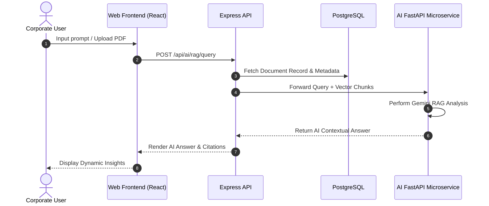

# 🏗️ Naziran Matrix ERP - Technical System Architecture

This document presents the high-level architecture, module design, security controls, microservice layout, and data flow of **Naziran Matrix ERP**.

---

## 📐 High-Level Architecture Diagram

```
                             ┌─────────────────────────────────────────┐
                             │       User Browser (Web Client)         │
                             │  React 19 + Vite + Tailwind v4 UI       │
                             └────────────────────┬────────────────────┘
                                                  │ HTTPS / REST API
                                                  ▼
                             ┌─────────────────────────────────────────┐
                             │     API Gateway / Node.js Express 5     │
                             │  - JWT Auth Guard & Rate Limit          │
                             │  - Request Interceptors & Error Handler  │
                             └──────────┬───────────────────┬──────────┘
                                        │                   │
                     ┌──────────────────┴──┐             ┌──┴──────────────────┐
                     ▼                     ▼             ▼                     ▼
             ┌───────────────┐     ┌───────────────┐  ┌───────────────┐  ┌───────────────┐
             │  HR & Payroll │     │   Inventory   │  │ Sales & CRM   │  │ Ledger Finance│
             │    Module     │     │    Module     │  │    Module     │  │    Module     │
             └───────┬───────┘     └───────┬───────┘  └───────┬───────┘  └───────┬───────┘
                     │                     │                  │                  │
                     └─────────────────────┼──────────────────┴──────────────────┘
                                           │ Prisma ORM
                                           ▼
                             ┌─────────────────────────────────────────┐
                             │    PostgreSQL 15 Relational DB          │
                             │    (Users, HR, Sales, Ledger, Docs)     │
                             └────────────────────┬────────────────────┘
                                                  │ Internal Service Proxy
                                                  ▼
                             ┌─────────────────────────────────────────┐
                             │       Python FastAPI AI Service         │
                             │  - Gemini LLM Integration               │
                             │  - Local RAG Vector Engine & PyPDF      │
                             └─────────────────────────────────────────┘
```

---

## 🧩 Core Architecture Layers

### 1. Presentation Layer (`apps/web`)
- **Technology**: React 19, TypeScript, Vite, TailwindCSS v4, Lucide React icons, Recharts.
- **State Management & Data Fetching**: Centralized Axios API client with automatic JWT bearer authorization header insertion and 401 response interceptors for seamless token refreshing.
- **Theme System**: Dynamic Light/Dark mode toggling backed by HTML class injection.
- **Responsive Layout**: Collapsible enterprise sidebar, top navigation bar with quick notifications drawer, global keyboard shortcuts (`Ctrl+K` command palette search).

### 2. Application API Layer (`apps/api`)
- **Technology**: Node.js, Express 5, TypeScript, Prisma ORM.
- **Middleware Infrastructure**:
  - `authenticateJWT`: Validates JWT Bearer tokens extracted from authorization headers.
  - `checkRole`: Enforces granular role-based permissions (`SUPER_ADMIN`, `HR`, `FINANCE`, `SALES`, `EMPLOYEE`).
  - `errorHandler`: Centralized Express error handler mapping custom `AppError` exceptions into clean HTTP status codes.
- **Security Protocols**:
  - `helmet`: HTTP headers protection.
  - `cors`: Restricted cross-origin resource sharing.
  - `express-rate-limit`: Prevents brute force login attacks.
  - Password Hashing: Bcrypt with 10 salt rounds.

### 3. Data Storage Layer (PostgreSQL & Prisma)
- **Technology**: PostgreSQL 15, Prisma Client.
- **Features**:
  - Strict foreign key constraints with cascade deletes where appropriate.
  - Compound unique constraints (e.g. `[employeeId, date]` for attendance and `[employeeId, month, year]` for payroll).
  - Automated database seeding script providing initial corporate structure and users.

### 4. AI Microservice Layer (`apps/ai-service`)
- **Technology**: Python 3.10+, FastAPI, Uvicorn, Google Gemini 1.5/2.0 API, PyPDF.
- **Features**:
  - **Natural Language Business Assistant**: Query company sales, attendance, and stock levels in plain English.
  - **Retrieval-Augmented Generation (RAG)**: Extracts text chunks from uploaded PDF handbooks, builds vector representations, and injects context into Gemini queries.
  - **Resume Screening**: Scores candidate resumes against job description keywords.
  - **Interview Prompt Generator**: Generates customized interview technical questions tailored by candidate role.

---

## 🔒 Security Architecture

```
User Request ──► CORS / Helmet Check ──► Rate Limiter ──► JWT Bearer Token Check ──► Role Access Guard ──► Controller Business Logic
```

1. **Token Lifecycle**:
   - **Access Token**: Signed JWT with 7-day expiration containing user ID, role, and email.
   - **Refresh Token**: Signed JWT with 30-day expiration stored in database `User.refreshToken`.
2. **Password Security**: Passwords are never stored in plain text; hashed using Bcrypt before DB insertion.
3. **Data Integrity**: Audit logging tracks schema mutations, and activity logging captures user sign-ins and IP addresses.

---

## 📡 Microservices Data Flow Sequence


