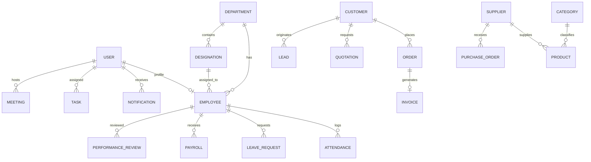

# 🗄️ Naziran Matrix ERP - Database Documentation & ER Architecture

This document provides a detailed breakdown of the relational database schema, data models, enumerations, table relationships, and index definitions powered by **PostgreSQL 15** and **Prisma ORM**.

---

## 📊 Visual Entity Relationship (ER) Diagram

---

## 🔠 Enumerations (`Enums`)

### 1. `Role`
- `SUPER_ADMIN`: Executive leadership with complete system privileges.
- `ADMIN`: System administrative staff.
- `HR`: Human resources officer managing staff, attendance, and payroll.
- `MANAGER`: Department manager approving reviews and tasks.
- `FINANCE`: Accountant managing transactions, invoices, and ledger.
- `SALES`: Sales executive managing CRM pipeline, orders, and quotes.
- `EMPLOYEE`: Regular employee profile.

### 2. `LeaveStatus` & `LeaveType`
- `LeaveStatus`: `PENDING`, `APPROVED`, `REJECTED`
- `LeaveType`: `ANNUAL`, `SICK`, `CASUAL`, `UNPAID`

### 3. `AttendanceStatus`
- `PRESENT`, `LATE`, `ABSENT`, `HALF_DAY`

### 4. `OrderStatus` & `InvoiceStatus`
- `OrderStatus`: `PENDING`, `PROCESSING`, `SHIPPED`, `DELIVERED`, `CANCELLED`
- `InvoiceStatus`: `UNPAID`, `PAID`, `OVERDUE`

---

## 📑 Core Data Tables

### 1. `User` (Authentication & Credentials)
Stores encrypted credentials, role definitions, and session refresh tokens.

| Column | Type | Constraints | Description |
| :--- | :--- | :--- | :--- |
| `id` | `String` | Primary Key, UUID | Unique user identifier |
| `email` | `String` | Unique, Not Null | Corporate email |
| `password` | `String` | Not Null | Bcrypt hashed password |
| `name` | `String` | Not Null | Display full name |
| `role` | `Role` | Default: `EMPLOYEE` | Access control role |
| `isVerified` | `Boolean` | Default: `false` | Email verification flag |
| `refreshToken` | `String?` | Nullable | Current active JWT refresh token |

---

### 2. `Employee` (HR Workspace)
Contains detailed employee profile records, salary configurations, and organizational links.

| Column | Type | Constraints | Description |
| :--- | :--- | :--- | :--- |
| `id` | `String` | Primary Key, UUID | Unique employee ID |
| `firstName` | `String` | Not Null | Given name |
| `lastName` | `String` | Not Null | Family name |
| `email` | `String` | Unique, Not Null | Contact email |
| `salary` | `Float` | Default: `0.0` | Base annual salary amount |
| `departmentId` | `String` | Foreign Key -> `Department.id` | Department reference |
| `designationId` | `String` | Foreign Key -> `Designation.id` | Job title reference |

---

### 3. `Attendance` (Daily Clock Records)
Tracks clock-in, clock-out, late penalties, and overtime.

| Column | Type | Constraints | Description |
| :--- | :--- | :--- | :--- |
| `id` | `String` | Primary Key, UUID | Attendance ID |
| `employeeId` | `String` | Foreign Key -> `Employee.id` | Employee reference |
| `date` | `Date` | Not Null | Attendance date (`YYYY-MM-DD`) |
| `clockIn` | `DateTime` | Not Null | Morning clock-in timestamp |
| `clockOut` | `DateTime?` | Nullable | Evening clock-out timestamp |
| `status` | `AttendanceStatus` | Default: `PRESENT` | Daily attendance status |
| `lateMinutes` | `Int` | Default: `0` | Minutes calculated late |

*Unique Index*: `[employeeId, date]`

---

### 4. `Payroll` (Compensation & Payslips)
Monthly salary processing table combining base salary, bonuses, tax, and net pay.

| Column | Type | Constraints | Description |
| :--- | :--- | :--- | :--- |
| `id` | `String` | Primary Key, UUID | Payroll ID |
| `employeeId` | `String` | Foreign Key -> `Employee.id` | Employee reference |
| `month` | `Int` | Not Null (1-12) | Pay period month |
| `year` | `Int` | Not Null | Pay period year |
| `basicSalary` | `Float` | Not Null | Base salary component |
| `allowance` | `Float` | Default: `0.0` | Housing / conveyance allowances |
| `deductions` | `Float` | Default: `0.0` | Penalties / tax deductions |
| `netSalary` | `Float` | Not Null | Final net payout amount |

*Unique Index*: `[employeeId, month, year]`

---

### 5. `Product` (Inventory Catalog)
SKU tracking, warehouse stock counts, unit prices, and min-stock threshold triggers.

| Column | Type | Constraints | Description |
| :--- | :--- | :--- | :--- |
| `id` | `String` | Primary Key, UUID | Product ID |
| `name` | `String` | Not Null | Item name |
| `sku` | `String` | Unique, Not Null | Stock Keeping Unit code |
| `price` | `Float` | Not Null | Retail selling price |
| `cost` | `Float` | Not Null | Purchasing wholesale cost |
| `stock` | `Int` | Default: `0` | Current available inventory count |
| `minStock` | `Int` | Default: `5` | Threshold triggering low-stock alert |
| `categoryId` | `String` | Foreign Key -> `Category.id` | Product category |
| `supplierId` | `String` | Foreign Key -> `Supplier.id` | Vendor supplier |

---

### 6. `Order` & `Invoice` (Sales Lifecycle)

#### `Order` Table
- `customerId`: Link to `Customer`
- `totalAmount`: Total price calculated
- `gstAmount`: Calculated tax component
- `items`: JSON array of line items `{ productId, quantity, price }`

#### `Invoice` Table
- `orderId`: Unique link to `Order`
- `invoiceNumber`: Unique formatted code (e.g. `INV-2026-0001`)
- `status`: `UNPAID`, `PAID`, `OVERDUE`
- `dueDate`: Payment deadline

---

### 7. `Transaction` (Financial General Ledger)
Central double-entry logging table for company income and expenditure.

| Column | Type | Constraints | Description |
| :--- | :--- | :--- | :--- |
| `id` | `String` | Primary Key, UUID | Transaction ID |
| `type` | `TransactionType` | `INCOME` / `EXPENSE` | Entry classification |
| `category` | `String` | Not Null | e.g. Salaries, Utilities, Sales |
| `amount` | `Float` | Not Null | Monetary value |
| `date` | `DateTime` | Default: `now()` | Transaction date |

---

## 🗂️ Database Seeding Script (`prisma/seed.ts`)

The automated seed script populates the database with:
- 5 Departments (Admin, HR, Finance, Sales, Engineering)
- 6 Designations with base salaries
- 6 Users & Employees across all roles with password `Password123`
- 10 days of historical attendance logs
- Product catalog & inventory stock levels
- Customers, Sales Orders, Invoices, & Financial ledger entries
